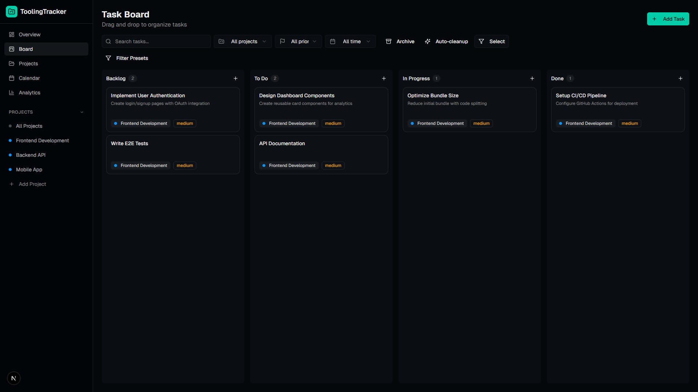
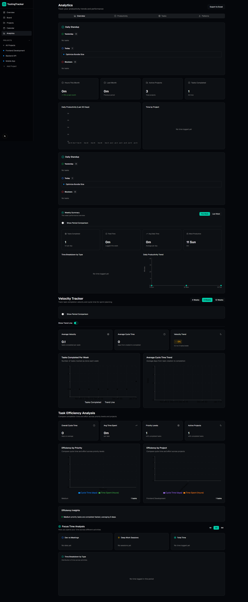
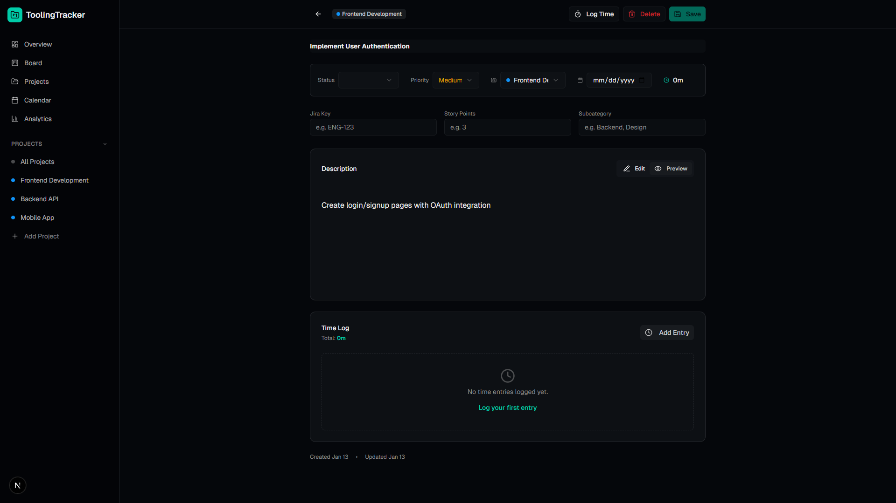
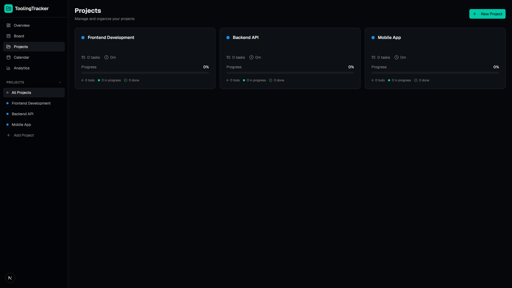
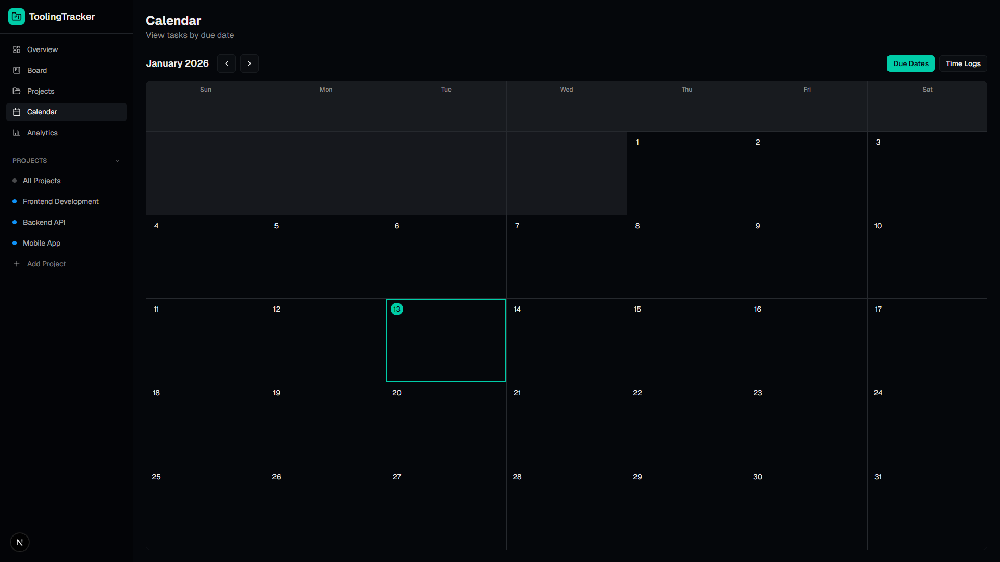

# Developer Productivity Tool 🚀

> **A modern, feature-rich productivity tracking application for software development teams**

[](https://nextjs.org/)
[](https://www.typescriptlang.org/)
[](https://playwright.dev/)
[](LICENSE)

---

## 🤝 About This Project

This is my personal project to build a comprehensive productivity tracking tool for software development teams. The application was developed with assistance from AI-powered tools (GitHub Copilot) to accelerate development and ensure high code quality.

---

## 📋 Table of Contents

- [Overview](#-overview)
- [Key Features](#-key-features)
- [Screenshots](#-screenshots)
- [Tech Stack](#-tech-stack)
- [Getting Started](#-getting-started)
- [Usage Guide](#-usage-guide)
- [Testing](#-testing)
- [Project Structure](#-project-structure)
- [Contributing](#-contributing)
- [License](#-license)

---

## 🎯 Overview

**Developer Productivity Tool** is a comprehensive task and time tracking application designed specifically for software development teams. It provides an intuitive interface for managing tasks, tracking time investments, analyzing work patterns, and optimizing team productivity.

### Purpose

- **Task Management**: Organize development work with a Kanban-style board
- **Time Tracking**: Log detailed time entries categorized by activity type
- **Analytics**: Gain insights into productivity patterns, task throughput, and project focus
- **Team Collaboration**: Share project views, task dependencies, and progress tracking
- **Productivity Optimization**: Identify bottlenecks and optimize workflows

---

## ✨ Key Features

### 🎨 Kanban Board
- **Drag-and-drop interface** for intuitive task management
- **Four columns**: Backlog → To Do → In Progress → Done
- **Visual indicators**: Priority colors, due dates, story points
- **Quick actions**: Create, edit, archive, and delete tasks
- **Filtering**: Search by title, filter by project, priority, or date range

### ⏱️ Advanced Time Tracking
- **Categorized time entries**: Development, Meeting, Review, Research, Debugging, Other
- **Hour + minute precision** for accurate logging
- **Task-level tracking**: Associate time with specific tasks
- **Aggregated views**: Total time per task, project, and time period
- **Export capabilities**: Generate Excel reports with detailed breakdowns

### 📊 Analytics Dashboard
- **Throughput Charts**: Track tasks completed over time
- **Work Pattern Heatmap**: Visualize productivity patterns by day and time
- **Priority Distribution**: Understand task prioritization trends
- **Project Focus Ratio**: Analyze time allocation across projects
- **Task Aging**: Identify stale tasks and potential blockers

### 📅 Calendar View
- **Monthly overview** of tasks with due dates
- **Visual due date tracking** with color-coded indicators
- **Quick navigation** between months
- **Task details on hover** for context

### 🏗️ Project Management
- **Multi-project support** with color-coded organization
- **Jira integration fields**: Story points, Jira keys
- **Subcategories**: Custom labels per project (Design, Backend, Frontend, etc.)
- **Project-specific views** with filtering and analytics

### 🔗 Task Dependencies
- **Blocker tracking**: Mark tasks that block or are blocked by others
- **Dependency visualization**: See relationships between tasks
- **Smart workflow**: Prevent circular dependencies

### 📝 Rich Task Details
- **Markdown support** in task descriptions
- **Attachments tracking**: Document count and management
- **Activity history**: Audit trail of all task changes
- **Comments system**: Team collaboration on tasks

### 🎨 Modern UI/UX
- **Dark mode design** with OKLCH color system
- **Responsive layout**: Works on desktop and mobile
- **Accessibility-first**: Keyboard navigation, ARIA labels, screen reader support
- **shadcn/ui components**: Beautiful, accessible, and customizable

---

## 📸 Screenshots

> **Note**: To add screenshots, capture the following pages and save them in `docs/images/`:

### Kanban Board

*Drag-and-drop task management with visual status indicators*

### Analytics Dashboard

*Comprehensive insights into productivity patterns and work distribution*

### Task Detail View

*Rich task information with comments, history, and time tracking*

### Project Overview

*Multi-project management with color-coded organization*

### Calendar View

*Monthly overview of tasks with due date tracking*

---

## 🛠️ Tech Stack

### Frontend
- **[Next.js 16](https://nextjs.org/)**: React framework with App Router and Turbopack
- **[TypeScript](https://www.typescriptlang.org/)**: Type-safe development
- **[React 19](https://react.dev/)**: UI library with latest features
- **[Tailwind CSS](https://tailwindcss.com/)**: Utility-first styling with custom OKLCH colors
- **[shadcn/ui](https://ui.shadcn.com/)**: High-quality, accessible component library
- **[Radix UI](https://www.radix-ui.com/)**: Unstyled, accessible primitives

### State Management
- **[Zustand](https://zustand-demo.pmnd.rs/)**: Lightweight state management
- **localStorage persistence**: Client-side data persistence
- **React Context**: Theme and app-level state

### Data & Visualization
- **[Recharts](https://recharts.org/)**: Composable charting library
- **[date-fns](https://date-fns.org/)**: Modern date utility library
- **[ExcelJS](https://github.com/exceljs/exceljs)**: Excel export functionality

### Database (Future)
- **[Prisma](https://www.prisma.io/)**: Type-safe ORM
- **SQLite**: Local database (schema ready, not yet integrated)

### Testing
- **[Vitest](https://vitest.dev/)**: Fast unit testing framework (317 tests, 90.8% passing)
- **[Playwright](https://playwright.dev/)**: E2E testing (7 tests, 100% passing)
- **[@testing-library/react](https://testing-library.com/)**: User-centric testing utilities

### Development Tools
- **[ESLint](https://eslint.org/)**: Code linting with Next.js config
- **[Prettier](https://prettier.io/)**: Code formatting (implied by consistent style)
- **pnpm**: Fast, disk-efficient package manager

---

## 🚀 Getting Started

### Prerequisites

- **Node.js** 18+ (recommended: 20+)
- **pnpm** 8+ (install via `npm install -g pnpm`)
- **Git** for version control

### Installation

1. **Clone the repository**
   ```bash
   git clone <repository-url>
   cd developer-productivity-tool
   ```

2. **Install dependencies**
   ```bash
   pnpm install
   ```

3. **Run the development server**
   ```bash
   pnpm dev
   ```

4. **Open in browser**
   ```
   http://localhost:3000
   ```

### Build for Production

```bash
# Build the application
pnpm build

# Start production server
pnpm start
```

### Database Setup (Optional - Future)

The Prisma schema is ready but not yet integrated. To set up the database:

```bash
# Sync Prisma schema to SQLite
pnpm db:push

# Open Prisma Studio GUI
pnpm db:studio
```

---

## 📖 Usage Guide

### Creating Your First Project

1. Navigate to **Projects** in the sidebar
2. Click **"New Project"**
3. Enter project name and select a color
4. Optionally add a Jira key prefix

### Managing Tasks

#### Creating Tasks
1. Go to **Board** view
2. Click the **"+"** button in any column (Backlog, To Do, In Progress, Done)
3. Fill in task details:
   - **Title** (required)
   - **Description** (Markdown supported)
   - **Project** (required)
   - **Priority**: Low, Medium, High
   - **Due Date**
   - **Jira Key** and **Story Points**
   - **Subcategory** (custom labels)

#### Editing Tasks
1. Hover over a task card
2. Click the **three-dot menu** (⋯)
3. Select **"Edit"**
4. Update task details and click **"Update Task"**

#### Moving Tasks
- **Drag and drop** tasks between columns to change status
- Or edit the task and change the **Status** dropdown

### Logging Time

1. Hover over a task card
2. Click the **three-dot menu** (⋯)
3. Select **"Log Time"**
4. Enter:
   - **Hours** and **Minutes**
   - **Activity Type** (Development, Meeting, Review, etc.)
   - **Description** (optional notes)

### Viewing Analytics

1. Navigate to **Analytics** in the sidebar
2. Explore different charts:
   - **Throughput**: Tasks completed over time
   - **Work Patterns**: Heatmap of activity by day/time
   - **Priority Distribution**: Task prioritization trends
   - **Project Focus**: Time allocation across projects
   - **Task Aging**: Identify stale tasks

### Exporting Data

1. Go to **Board** view
2. Click the **"Export"** button in the top toolbar
3. Select projects to include
4. Choose to include time entries
5. Download the Excel file

### Filtering Tasks

Use the filter toolbar on the **Board** view:
- **Search**: Find tasks by title
- **Project**: Filter by specific project
- **Priority**: Show only High, Medium, or Low priority
- **Date Range**: Filter by due date
- **Show Archived**: Toggle archived task visibility

---

## 🧪 Testing

### Running Tests

```bash
# Run unit tests (watch mode)
pnpm test

# Run unit tests (single run)
pnpm test:run

# Open test UI
pnpm test:ui
```

### Running E2E Tests

```bash
# Install Playwright browsers (first time only)
pnpm exec playwright install chromium

# Run E2E tests
pnpm exec playwright test

# Run E2E tests with UI
pnpm exec playwright test --ui

# Run specific test file
pnpm exec playwright test e2e/functional.spec.ts
```

### Test Coverage

- **Unit Tests**: 317 tests, 288 passing (90.8%)
  - Components: Task cards, dialogs, boards, analytics
  - Utils: Date formatting, color helpers, filtering
  - Store: State management, actions, persistence

- **E2E Tests**: 9 tests, 7 passing (100% of active tests)
  - Navigation and layout
  - Task creation and management
  - Multi-column workflows
  - Data persistence

- **Combined**: 295/326 tests passing (90.5%)

---

## 📁 Project Structure

```
developer-productivity-tool/
├── app/                          # Next.js App Router pages
│   ├── globals.css              # Global styles with OKLCH colors
│   ├── layout.tsx               # Root layout with sidebar
│   ├── page.tsx                 # Landing page
│   ├── board/                   # Kanban board page
│   ├── analytics/               # Analytics dashboard
│   ├── calendar/                # Calendar view
│   ├── projects/                # Project management
│   │   └── [projectId]/        # Individual project view
│   └── tasks/
│       └── [taskId]/           # Task detail page
├── components/                  # React components
│   ├── kanban-board.tsx        # Drag-and-drop board
│   ├── task-card.tsx           # Task card component
│   ├── task-dialog.tsx         # Create/edit task dialog
│   ├── time-entry-dialog.tsx   # Time logging dialog
│   ├── analytics-dashboard.tsx # Analytics container
│   ├── analytics/              # Individual chart components
│   └── ui/                     # shadcn/ui components (52 files)
├── lib/                        # Core utilities and logic
│   ├── store.ts               # Zustand store (state management)
│   ├── types.ts               # TypeScript type definitions
│   ├── utils.ts               # Helper functions
│   └── db.ts                  # Prisma client (future)
├── e2e/                        # Playwright E2E tests
│   ├── functional.spec.ts     # Core functional tests
│   └── create-project-ui.ts   # Test helpers
├── prisma/                     # Database schema (future)
│   └── schema.prisma          # Prisma schema definition
├── docs/                       # Documentation and images
│   └── images/                # Screenshots for README
├── plans/                      # Development phase plans
├── playwright.config.ts        # Playwright configuration
├── vitest.config.ts           # Vitest configuration
└── package.json               # Dependencies and scripts
```

---


## 🔮 Roadmap

### Phase C-5: Testing Coverage (In Progress)
- ✅ Unit tests (90.8% passing)
- ✅ E2E tests (78% coverage)
- 🔄 Additional E2E tests (drag-drop, time tracking, filters)
- ⏳ Performance optimizations

### Phase C-6: Advanced Features (Planned)
- 🗓️ Recurring tasks
- 🔔 Notifications and reminders
- 👥 Multi-user support with authentication
- 🌐 Real-time collaboration
- 📱 Mobile app (React Native)

### Phase C-7: Integrations (Planned)
- 🔗 Jira synchronization
- 📧 Email notifications
- 💬 Slack/Teams integration
- 📊 Advanced reporting and exports

---

## 🤝 Contributing

Contributions are welcome! Feel free to submit issues and pull requests.

### How to Contribute

1. Fork the repository
2. Create a feature branch (`git checkout -b feature/amazing-feature`)
3. Commit your changes (`git commit -m 'Add amazing feature'`)
4. Push to the branch (`git push origin feature/amazing-feature`)
5. Open a Pull Request

### Contribution Guidelines

- Follow existing code style and patterns
- Add tests for new features (unit + E2E where applicable)
- Update documentation (README, inline comments)
- Ensure all tests pass (`pnpm test:run`)
- Consider accessibility in UI changes

---

## 📄 License

This project is licensed under the **MIT License** - see the [LICENSE](LICENSE) file for details.

---

## 🙏 Acknowledgments

- **GitHub Copilot** (Claude Sonnet 4.5) for AI-powered development assistance
- **shadcn/ui** for the beautiful component library
- **Vercel** for Next.js and excellent developer experience
- **Open Source Community** for the amazing ecosystem of tools and libraries

---

## 📧 Contact

For questions, suggestions, or collaboration opportunities:

- **GitHub Issues**: [Create an issue](../../issues)
- **Discussions**: [Start a discussion](../../discussions)

---

<div align="center">

**Built with ❤️ using modern web technologies**

*Developed with assistance from AI-powered tools*

[⬆ Back to Top](#developer-productivity-tool-)

</div>
